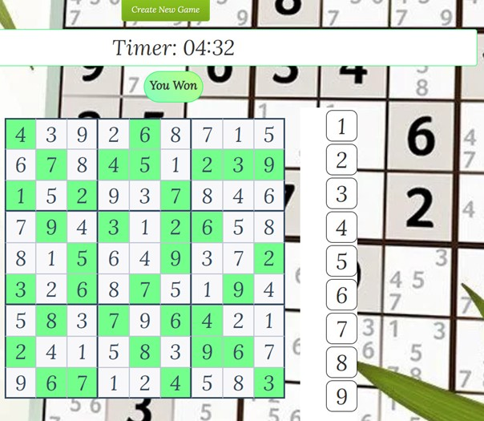

# Sudoku Web Application
 

## Table of Contents
1. [Introduction](#introduction)
2. [Technologies Used](#technologies-used)
3. [Features](#features)
4. [System Architecture](#system-architecture)
5. [Roles and Contributions](#roles-and-contributions)
6. [Database Design](#database-design)
7. [Achievements](#achievements)
8. [How to Run](#how-to-run)
9. [License](#license)

---

## Introduction
The **Sudoku Web Application** is a web-based game designed to provide an engaging and interactive experience for users. The application allows players to solve Sudoku puzzles with varying difficulty levels, offering real-time feedback and validation for an optimal gaming experience. Built using the **ASP.NET MVC framework** and **JavaScript**, this project emphasizes performance, scalability, and user-friendliness, ensuring accessibility for a wide range of users.

---

## Technologies Used
- **Backend**: ASP.NET MVC (C#) for server-side logic, routing, and view rendering.
- **Frontend**:
  - JavaScript for dynamic and interactive UI.
  - Materialize CSS for a responsive and modern design.
- **Database**: Microsoft SQL Server for storing game data, including puzzles, user progress, and scores.
- **AJAX and jQuery**: For seamless asynchronous operations and UI updates.

---

## Features
- **Dynamic Puzzle Generation**: Sudoku puzzles are generated dynamically with multiple difficulty levels (Easy, Medium, Hard).
- **Real-Time Validation**: Users receive instant feedback on their inputs to ensure the correctness of their moves.
- **Progress Tracking**: User progress is saved, allowing them to resume puzzles later.
- **Responsive Design**: The application is optimized for desktop and mobile devices.

---

## System Architecture
The application is designed using the **MVC (Model-View-Controller)** architecture:

1. **Model**:
   - Represents the game data and handles database interactions.
   - Manages puzzle data, user records, and scores.

2. **View**:
   - Provides the user interface for players to interact with the game.
   - Built using Materialize CSS and JavaScript for a clean and responsive design.

3. **Controller**:
   - Acts as a bridge between the Model and the View.
   - Handles user inputs, processes game logic, and updates the View accordingly.

---

## Roles and Contributions
### **Lead Developer**
- Designed and implemented the overall system architecture.

### **Backend Development**
- Created server-side logic for:
  - Puzzle generation.
  - User management.
  - Game mechanics.

### **Frontend Development**
- Developed an interactive UI using JavaScript and AJAX for real-time user feedback.

### **Database Design**
- Created a normalized schema for storing:
  - Sudoku puzzles.
  - User progress.
  - Scores.

### **System Testing**
- Conducted extensive manual testing to ensure:
  - Puzzle validation accuracy.
  - Smooth gameplay.
  - Efficient database operations.

---

## Database Design
The database schema includes the following key tables:

1. **Users**:
   - Stores user information, including username and password (hashed).
   
2. **Puzzles**:
   - Contains pre-generated Sudoku puzzles categorized by difficulty level.

3. **GameProgress**:
   - Tracks the current state of the game for each user, including partially completed puzzles.

---

## Achievements
- Developed a fully functional and responsive Sudoku game.
- Successfully implemented dynamic difficulty levels to enhance user engagement.
- Optimized game performance for real-time validation and puzzle generation.
- Delivered the project on time, meeting all specifications and user requirements.

---

## How to Run

### Prerequisites:
1. Install **Visual Studio** with ASP.NET MVC support.
2. Install **Microsoft SQL Server**.

### Steps:
1. Clone the repository to your local machine.
2. Open the solution file in Visual Studio.
3. Configure the database connection string in the `web.config` file.
4. Run the SQL scripts provided in the `Database` folder to set up the database.
5. Build and run the project.
6. Access the application in your browser at `http://localhost:[port]/`.

---

## License
This project is licensed under the MIT License. See the LICENSE file for more details.
